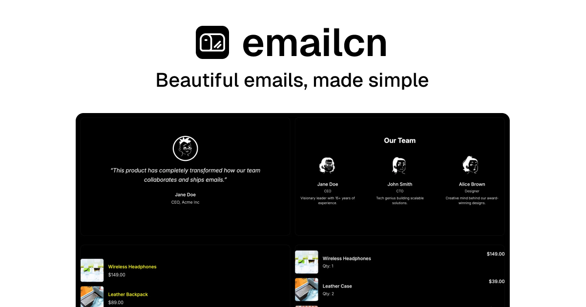

<h1 align="center">emailcn</h1>

<p align="center">
  Free & open-source, shadcn/ui-compatible React Email components and blocks.<br/>
  Zero config. One command setup. Built on <a href="https://react.email">React Email</a>, works seamlessly with <a href="https://ui.shadcn.com/">shadcn/ui</a>.
</p>

<p align="center">
  <a href="https://emailcn.dev/docs">Get Started</a> ·
  <a href="https://emailcn.dev/docs/installation">Installation</a> ·
  <a href="https://emailcn.dev/docs/components">Components</a>
</p>

<br />

<p align="center">
  
</p>

## Features

- 🎨 **Theme-aware** — Multiple built-in themes (Vercel, Linear, Stripe, GitHub, Notion, Raycast, Twitch, Airbnb, Slack)
- 🎯 **Zero config** — Works out of the box with sensible defaults
- 📦 **shadcn/ui compatible** — Uses the same registry format and CLI
- 📧 **React Email v6** — Built on the latest React Email
- 🧩 **Composable** — Build complex emails with simple, declarative components
- 📱 **Responsive** — Works across all email clients

## Quick Start

```bash
# Install react-email
npm install react-email

# Add a theme
npx shadcn@latest add https://emailcn.dev/r/email-theme-default.json

# Add components
npx shadcn@latest add https://emailcn.dev/r/email-hero.json
npx shadcn@latest add https://emailcn.dev/r/email-footer.json

# Or add complete email blocks
npx shadcn@latest add https://emailcn.dev/r/block-onboarding-default.json
```

## Available Themes

| Theme   | Description                 |
| ------- | --------------------------- |
| Default | Clean, minimal design       |
| Vercel  | Dark theme with white text  |
| Linear  | Purple accent, modern       |
| Stripe  | Indigo accent, professional |
| GitHub  | Dark theme for developers   |
| Notion  | Minimal, clean aesthetic    |
| Raycast | Dark with coral accent      |
| Twitch  | Purple accent               |
| Airbnb  | Coral/red accent            |
| Slack   | Purple accent               |

## Available Components

- **LogoHeader** — Company logo with navigation links
- **Hero** — Heading, subheading, and CTA
- **ContentGrid** — Feature grid (2-3 columns)
- **FeatureRow** — Image + text row
- **PricingTable** — Pricing plans display
- **Testimonial** — Quote with avatar
- **SocialLinks** — Social media links
- **Footer** — Company info and links
- **CTABanner** — Call-to-action banner
- **Divider** — Horizontal divider
- **AvatarRow** — Avatar with name/title
- **ProductCard** — Product display card

## Available Blocks

- **Onboarding** — Welcome emails (default, vercel, linear)
- **Auth** — Magic link, OTP, password reset (multiple themes)
- **Receipt** — Order receipts (default, stripe, apple, nike)
- **Notification** — User notifications (default, linear, airbnb, slack)
- **Newsletter** — Email newsletters (default, stack-overflow)
- **Invite** — Team invitations (default, vercel)

## Contributing

Contributions are welcome! Please feel free to submit a Pull Request.

1. Fork the repository
2. Create your feature branch (`git checkout -b feature/amazing-feature`)
3. Commit your changes (`git commit -m 'Add some amazing feature'`)
4. Push to the branch (`git push origin feature/amazing-feature`)
5. Open a Pull Request

## License

[MIT](LICENSE)

## Star History

<a href="https://www.star-history.com/?repos=Aniket-508%2Femailcn&type=date&legend=top-left">
 <picture>
   <source media="(prefers-color-scheme: dark)" srcset="https://api.star-history.com/chart?repos=Aniket-508/emailcn&type=date&theme=dark&legend=top-left" />
   <source media="(prefers-color-scheme: light)" srcset="https://api.star-history.com/chart?repos=Aniket-508/emailcn&type=date&legend=top-left" />
   
 </picture>
</a>
